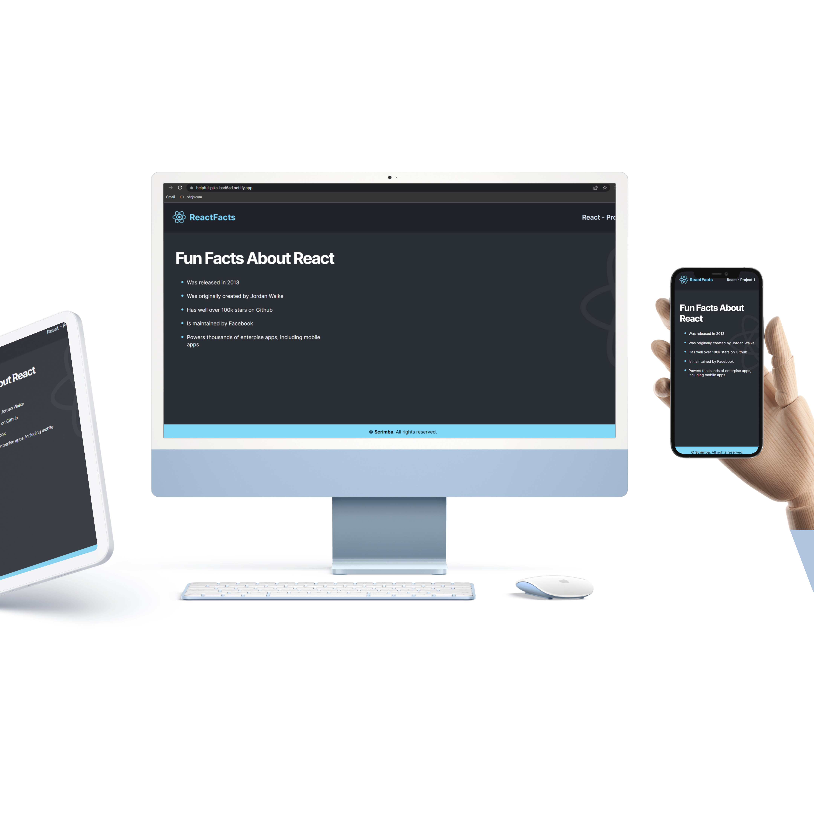
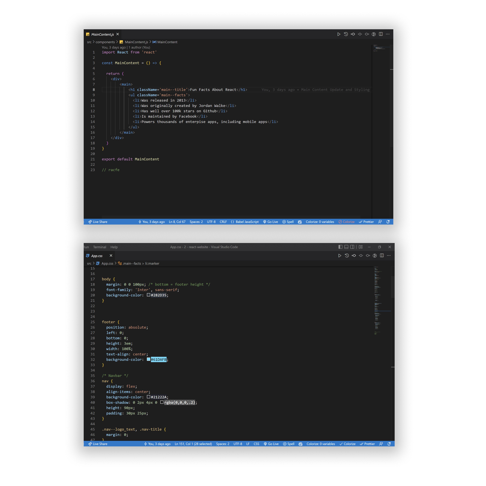

<!-- markdownlint-configure-file {
  "MD013": {
    "code_blocks": false,
    "tables": false
  },
  "MD033": false,
  "MD041": false
} -->

  

# React Website About

This is the React Website About Project. 🧬 The project is made by React JS Code and with update dark mode feature.🔵
This is a Scrimba Challenge Project # 1 from the Ultimate React 101 Course. 

React Website About: John Cañero
Guide by Scrimba

## Website

🖥️ [https://react-website-by-johncanero.vercel.app/]

✍️ Project by John Cañero

## Responsive Design

🪟: [Desktop - Tablet - Mobile]

